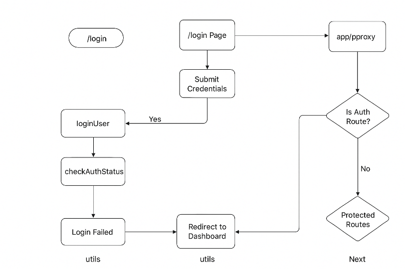

## PH-HEALTHCARE-FRONTEND-PART-2

GitHub Link: https://github.com/Apollo-Level2-Web-Dev/ph-health-care/tree/part-2


## 66-1 Login flow and discussion about cookies

- for token the ip address should be same .
- we use `samesite : none`. This means site is different and the token is passed using `https` or other protocol.
- when  `samesite : lax` this means site is different but the token is passed using `http` protocol. and its customizable.
- when `samesite : strict` this means site is same and the token is passed using `http` protocol.
- when we use `http` protocol the token is not secure.
- when we use `https` protocol the token is secure.
- We are dealing the cookie from the backend. we have to get and use the cookie in frontend.
- `We can easily grab the cookie easily when frontend and backend uses the similar server.` but next.js backend is not perfect enough.there is some issues in scalability and it will be bit slower and further upgradation in micro service will not be available.
- `We can not grab the cookie easily when frontend and backend uses different server.` there are some extra layer like cors.
- we can solve this cookie will be handled by backend no much lingering in frontend. we will just send from frontend and backend will verify the cookie token.

## 66-2 Why do you have to use ‘use client’

- install 

```
npm install react-hook-form
```

```
npm install @hookform/resolvers zod
```

```
npx shadcn@latest add form
```

## 66-3 Login component and functionality part-1

- src -> utils -> login.ts 

```ts 
const loginUser = async (email: string, password: string) => {
    const res = await fetch(`${process.env.NEXT_PUBLIC_API_URL}/auth/login`, {
        method: "POST",
        headers: {
            "Content-Type": "application/json",
        },
        body: JSON.stringify({ email, password }),
        credentials : "include"
    });

    console.log(res)
    return res
};

export default loginUser;
```
- src -> components -> modules -> Auth -> Login.tsx

```tsx
/* eslint-disable @typescript-eslint/no-explicit-any */

"use client";
import { Button } from "@/components/ui/button";
import {
    Card,
    CardContent,
    CardDescription,
    CardFooter,
    CardHeader,
    CardTitle,
} from "@/components/ui/card";
import { Input } from "@/components/ui/input";
import Link from "next/link";
import { useForm } from "react-hook-form";
import { zodResolver } from "@hookform/resolvers/zod";
import * as z from "zod";
import { useState } from "react";
import { Loader2, Eye, EyeOff } from "lucide-react";

import {
    Form,
    FormControl,
    FormField,
    FormItem,
    FormLabel,
    FormMessage,
} from "@/components/ui/form";
import loginUser from "@/utils/login";


const loginSchema = z.object({
    email: z.string().email({ message: "Invalid email address" }),
    password: z
        .string()
        .min(6, { message: "Password must be at least 6 characters" }),
});

type LoginFormData = z.infer<typeof loginSchema>;

export default function Login() {
    const [showPassword, setShowPassword] = useState(false);
    const [isLoading, setIsLoading] = useState(false);
    const [error, setError] = useState<string | null>(null);

    const form = useForm<LoginFormData>({
        resolver: zodResolver(loginSchema),
        defaultValues: {
            email: "",
            password: "",
        },
    });

    const onSubmit = async (data: LoginFormData) => {
        console.log(data);
        setIsLoading(true);
        setError(null);

        try {
            const res = await loginUser(data.email, data.password)
            console.log("Login Successful :", res)
        } catch (error: any) {
            setError(error.message || "Something went wrong check Your Credentials and Try again");
        } finally {
            setIsLoading(false);
        }
    };

    return (
        <div className="flex flex-col items-center justify-center min-h-[calc(100vh-140px)] py-12 px-4">
            <div className="text-center mb-4">
                <Link href="/">
                    <span className="text-3xl font-bold text-primary cursor-pointer">
                        PH Health Care
                    </span>
                </Link>
            </div>

            <Card className="w-full max-w-md">
                <Form {...form}>
                    <form onSubmit={form.handleSubmit(onSubmit)}>
                        <CardHeader className="text-center">
                            <CardTitle className="text-2xl">Welcome Back!</CardTitle>
                            <CardDescription>
                                Sign in to access your dashboard.
                            </CardDescription>
                        </CardHeader>

                        <CardContent className="grid gap-4">
                            {error && (
                                <p className="text-red-500 text-sm text-center bg-red-100 p-2 rounded-md">
                                    {error}
                                </p>
                            )}

                            <FormField
                                control={form.control}
                                name="email"
                                render={({ field }) => (
                                    <FormItem>
                                        <FormLabel>Email</FormLabel>
                                        <FormControl>
                                            <Input
                                                type="email"
                                                placeholder="m@example.com"
                                                {...field}
                                            />
                                        </FormControl>
                                        <FormMessage />
                                    </FormItem>
                                )}
                            />

                            <FormField
                                control={form.control}
                                name="password"
                                render={({ field }) => (
                                    <FormItem>
                                        <FormLabel>Password</FormLabel>
                                        <FormControl>
                                            <div className="relative">
                                                <Input
                                                    type={showPassword ? "text" : "password"}
                                                    className="pr-10"
                                                    {...field}
                                                />
                                                <button
                                                    type="button"
                                                    onClick={() => setShowPassword(!showPassword)}
                                                    className="absolute inset-y-0 right-0 flex items-center justify-center h-full w-10 text-muted-foreground"
                                                    aria-label={
                                                        showPassword ? "Hide password" : "Show password"
                                                    }
                                                >
                                                    {showPassword ? (
                                                        <EyeOff className="h-5 w-5" />
                                                    ) : (
                                                        <Eye className="h-5 w-5" />
                                                    )}
                                                </button>
                                            </div>
                                        </FormControl>
                                        <FormMessage />
                                    </FormItem>
                                )}
                            />
                        </CardContent>

                        <CardFooter className="flex flex-col gap-4 mt-2">
                            <Button className="w-full" type="submit" disabled={isLoading}>
                                {isLoading && <Loader2 className="mr-2 h-4 w-4 animate-spin" />}
                                Sign In
                            </Button>
                            <div className="text-center text-sm">
                                Don&apos;t have an account?{" "}
                                <Link href="/register" className="underline">
                                    Sign up
                                </Link>
                            </div>
                            <button className="text-center text-sm text-muted-foreground">
                                <Link href="/" className="underline">
                                    back to home
                                </Link>
                            </button>
                        </CardFooter>
                    </form>
                </Form>
            </Card>
        </div>
    );
}
```
## 66-4 Login component and functionality part-2
- Now Lets make the functionality to send the cookie in frontend

- src -> utils -> login.ts

```ts 
/* eslint-disable @typescript-eslint/no-explicit-any */
const loginUser = async (email: string, password: string) => {
    try {
        const res = await fetch(`${process.env.NEXT_PUBLIC_API_URL}/auth/login`, {
            method: "POST",
            headers: {
                "Content-Type": "application/json",
            },
            body: JSON.stringify({ email, password }),
            credentials: "include"
        });

        console.log(res)
        const data = await res.json();
        return data
    } catch (error: any) {
        console.log(error)
        throw new Error(error.message)
    }
};

export default loginUser;
```

- src -> utils -> login.ts 

```ts 

    const onSubmit = async (data: LoginFormData) => {
        console.log(data);
        setIsLoading(true);
        setError(null);

        try {
            const res = await loginUser(data.email, data.password)
            console.log("Login Successful :", res)

            if (res.success) {
                // window.location.href = "/dashboard";

                router.push("/dashboard")
            } else {
                setError(res.message || "Login Failed, Please Try Again")
            }

        } catch (error: any) {
            setError(error.message || "Something went wrong check Your Credentials and Try again");
        } finally {
            setIsLoading(false);
        }
    };
```

- full version 

```tsx
/* eslint-disable @typescript-eslint/no-explicit-any */

"use client";
import { Button } from "@/components/ui/button";
import {
    Card,
    CardContent,
    CardDescription,
    CardFooter,
    CardHeader,
    CardTitle,
} from "@/components/ui/card";
import { Input } from "@/components/ui/input";
import Link from "next/link";
import { useForm } from "react-hook-form";
import { zodResolver } from "@hookform/resolvers/zod";
import * as z from "zod";
import { useState } from "react";
import { Loader2, Eye, EyeOff } from "lucide-react";

import {
    Form,
    FormControl,
    FormField,
    FormItem,
    FormLabel,
    FormMessage,
} from "@/components/ui/form";
import loginUser from "@/utils/login";
import { useRouter } from "next/navigation";


const loginSchema = z.object({
    email: z.string().email({ message: "Invalid email address" }),
    password: z
        .string()
        .min(6, { message: "Password must be at least 6 characters" }),
});

type LoginFormData = z.infer<typeof loginSchema>;

export default function Login() {
    const [showPassword, setShowPassword] = useState(false);
    const [isLoading, setIsLoading] = useState(false);
    const [error, setError] = useState<string | null>(null);
    const router = useRouter() // as we are using "use client" we are using this if its "use server" we have to use redirect 

    const form = useForm<LoginFormData>({
        resolver: zodResolver(loginSchema),
        defaultValues: {
            email: "",
            password: "",
        },
    });

    const onSubmit = async (data: LoginFormData) => {
        console.log(data);
        setIsLoading(true);
        setError(null);

        try {
            const res = await loginUser(data.email, data.password)
            console.log("Login Successful :", res)

            if (res.success) {
                // window.location.href = "/dashboard";

                router.push("/dashboard")
            } else {
                setError(res.message || "Login Failed, Please Try Again")
            }

        } catch (error: any) {
            setError(error.message || "Something went wrong check Your Credentials and Try again");
        } finally {
            setIsLoading(false);
        }
    };

    return (
        <div className="flex flex-col items-center justify-center min-h-[calc(100vh-140px)] py-12 px-4">
            <div className="text-center mb-4">
                <Link href="/">
                    <span className="text-3xl font-bold text-primary cursor-pointer">
                        PH Health Care
                    </span>
                </Link>
            </div>

            <Card className="w-full max-w-md">
                <Form {...form}>
                    <form onSubmit={form.handleSubmit(onSubmit)}>
                        <CardHeader className="text-center">
                            <CardTitle className="text-2xl">Welcome Back!</CardTitle>
                            <CardDescription>
                                Sign in to access your dashboard.
                            </CardDescription>
                        </CardHeader>

                        <CardContent className="grid gap-4">
                            {error && (
                                <p className="text-red-500 text-sm text-center bg-red-100 p-2 rounded-md">
                                    {error}
                                </p>
                            )}

                            <FormField
                                control={form.control}
                                name="email"
                                render={({ field }) => (
                                    <FormItem>
                                        <FormLabel>Email</FormLabel>
                                        <FormControl>
                                            <Input
                                                type="email"
                                                placeholder="m@example.com"
                                                {...field}
                                            />
                                        </FormControl>
                                        <FormMessage />
                                    </FormItem>
                                )}
                            />

                            <FormField
                                control={form.control}
                                name="password"
                                render={({ field }) => (
                                    <FormItem>
                                        <FormLabel>Password</FormLabel>
                                        <FormControl>
                                            <div className="relative">
                                                <Input
                                                    type={showPassword ? "text" : "password"}
                                                    className="pr-10"
                                                    {...field}
                                                />
                                                <button
                                                    type="button"
                                                    onClick={() => setShowPassword(!showPassword)}
                                                    className="absolute inset-y-0 right-0 flex items-center justify-center h-full w-10 text-muted-foreground"
                                                    aria-label={
                                                        showPassword ? "Hide password" : "Show password"
                                                    }
                                                >
                                                    {showPassword ? (
                                                        <EyeOff className="h-5 w-5" />
                                                    ) : (
                                                        <Eye className="h-5 w-5" />
                                                    )}
                                                </button>
                                            </div>
                                        </FormControl>
                                        <FormMessage />
                                    </FormItem>
                                )}
                            />
                        </CardContent>

                        <CardFooter className="flex flex-col gap-4 mt-2">
                            <Button className="w-full" type="submit" disabled={isLoading}>
                                {isLoading && <Loader2 className="mr-2 h-4 w-4 animate-spin" />}
                                Sign In
                            </Button>
                            <div className="text-center text-sm">
                                Don&apos;t have an account?{" "}
                                <Link href="/register" className="underline">
                                    Sign up
                                </Link>
                            </div>
                            <button className="text-center text-sm text-muted-foreground">
                                <Link href="/" className="underline">
                                    back to home
                                </Link>
                            </button>
                        </CardFooter>
                    </form>
                </Form>
            </Card>
        </div>
    );
}
```

## 66-5 middleware.ts renamed as proxy.ts in nextjs 16

- now we have to use middleware to check the login status and check the auth status and preventing from accessing unauthorized page 

- src -> proxy.ts 

```ts 
import { NextResponse } from 'next/server'
import type { NextRequest } from 'next/server'
 
// This function can be marked `async` if using `await` inside
export function proxy(request: NextRequest) {
  return NextResponse.redirect(new URL('/home', request.url))
}
 
// See "Matching Paths" below to learn more
export const config = {
  matcher: '/about/:path*',
}
```
- lets modify it 

```ts 
import { NextResponse } from 'next/server'
import type { NextRequest } from 'next/server'

// This function can be marked `async` if using `await` inside
export function proxy(request: NextRequest) {

    const token = request.cookies.get('token')?.value

    const { pathname } = request.nextUrl;

    const protectedPaths = ['/dashboard', '/profile', '/appointments']

    const authRoutes = ['/login', '/register', '/forgot-password']

    //   return NextResponse.redirect(new URL('/', request.url))

    const isProtectedPath = protectedPaths.some((path) => {
        pathname.startsWith(path);

    })

    const isAuthRoute = authRoutes.some((path) => {
        pathname.startsWith(path);
    })


    if(isProtectedPath && !token){
        return NextResponse.redirect(new URL("/login", request.nextUrl))
    }

    if(isAuthRoute && token ){
        return NextResponse.redirect(new URL("/", request.nextUrl))
    }

}

// See "Matching Paths" below to learn more
export const config = {
    matcher: ['/dashboard/:path*', "/login", "/register", "/forgot-password"],
}
```
## 66-6 proxy.ts issue fix and get me route use.

- there is some issue in proxy.ts file we have to fix it. the login route is visible even if the user is logged in 

- src -> proxy.ts

```ts 

import { NextResponse } from 'next/server'
import type { NextRequest } from 'next/server'

// This function can be marked `async` if using `await` inside
export function proxy(request: NextRequest) {

    const token = request.cookies.get('accessToken')?.value

    const { pathname } = request.nextUrl;

    const protectedPaths = ['/dashboard', '/profile', '/appointments']

    const authRoutes = ['/login', '/register', '/forgot-password']

    //   return NextResponse.redirect(new URL('/', request.url))

    const isProtectedPath = protectedPaths.some((path) => {
        pathname.startsWith(path);

    })

    const isAuthRoute = authRoutes.some((route) => pathname === route)


    if(isProtectedPath && !token){
        return NextResponse.redirect(new URL("/login", request.nextUrl))
    }

    if(isAuthRoute && token ){
        return NextResponse.redirect(new URL("/", request.nextUrl))
    }

    return NextResponse.next();

}

// See "Matching Paths" below to learn more
export const config = {
    matcher: ['/dashboard/:path*', "/login", "/register", "/forgot-password"],
}
```

## 66-7 checkAuthStatus utility and redirect to the dashboard

- Final Complete version of login and authentication works


- utils -> login.ts

```ts
/* eslint-disable @typescript-eslint/no-explicit-any */
const loginUser = async (email: string, password: string) => {
  try {
    const res = await fetch(`${process.env.NEXT_PUBLIC_API_URL}/auth/login`, {
      method: "POST",
      headers: {
        "Content-Type": "application/json",
      },
      body: JSON.stringify({ email, password }),
      credentials: "include",
    });
    const data = await res.json();
    return data;
  } catch (err: any) {
    throw new Error(
      err.message || "An error occurred while logging in."
    );
  }
};

export default loginUser;
```

- utils -> auth.ts

```ts

/* eslint-disable @typescript-eslint/no-explicit-any */
const checkAuthStatus = async () => {
    try {
        const res = await fetch(`${process.env.NEXT_PUBLIC_API_URL}/auth/me`, {
            method: "GET",
            headers: {
                "Content-Type": "application/json",
            },
            credentials: "include",
        });
        const data = await res.json();

        if(!res.ok){
            throw new Error("Failed to fetch authentication status.");
        }
        
        return {
            isAuthenticated: true,
            user: data.data,
        }

    } catch (err: any) {
        console.log(err.message)
        return{
            isAuthenticated: false,
            user: null,
        }
    }

}

export default checkAuthStatus;
```


- app -> proxy.ts

```ts
import { NextResponse } from 'next/server'
import type { NextRequest } from 'next/server'
 
// This function can be marked `async` if using `await` inside
export function proxy(request: NextRequest) {

    const token = request.cookies.get('accessToken')?.value;

    console.log(token)

    const { pathname } = request.nextUrl;

    const protectedPaths = ['/dashboard/*', '/profile', '/settings', '/appointments'];

    const authRoutes = ['/login', '/register', '/forgot-password'];

    const isProtectedPath = protectedPaths.some((path) => {
        pathname.startsWith(path);
    })

    // current path auth route or not
    const isAuthRoute = authRoutes.some((route)=>
        pathname === route
    )

    console.log(isAuthRoute)

    if(isProtectedPath && !token){
        return NextResponse.redirect(new URL('/login', request.url))
    }

    if(isAuthRoute && token){
        console.log('hitting the correct block')
        return NextResponse.redirect(new URL('/', request.url))
    }

    return NextResponse.next()
}
 
// See "Matching Paths" below to learn more
export const config = {
  matcher: ['/dashboard/:path*', '/login', '/register', '/forgot-password'],
}
```

- components -> modules -> Auth -> Login.tsx

```tsx
/* eslint-disable @typescript-eslint/no-explicit-any */
"use client";
import { Button } from "@/components/ui/button";
import {
  Card,
  CardContent,
  CardDescription,
  CardFooter,
  CardHeader,
  CardTitle,
} from "@/components/ui/card";
import { Input } from "@/components/ui/input";
import Link from "next/link";
import { useForm } from "react-hook-form";
import { zodResolver } from "@hookform/resolvers/zod";
import * as z from "zod";
import { useState } from "react";
import { Loader2, Eye, EyeOff } from "lucide-react";

import {
  Form,
  FormControl,
  FormField,
  FormItem,
  FormLabel,
  FormMessage,
} from "@/components/ui/form";

import { useRouter } from "next/navigation";
import loginUser from "@/utils/login";
import checkAuthStatus from "@/utils/auth";


const loginSchema = z.object({
  email: z.string().email({ message: "Invalid email address" }),
  password: z
    .string()
    .min(6, { message: "Password must be at least 6 characters" }),
});

type LoginFormData = z.infer<typeof loginSchema>;

export default function Login() {
  const [showPassword, setShowPassword] = useState(false);
  const [isLoading, setIsLoading] = useState(false);
  const [error, setError] = useState<string | null>(null);
  const router = useRouter();

  const form = useForm<LoginFormData>({
    resolver: zodResolver(loginSchema),
    defaultValues: {
      email: "",
      password: "",
    },
  });

  const onSubmit = async (data: LoginFormData) => {
    console.log(data);
    setIsLoading(true);
    setError(null);

    //Hashed string for "super@admin": $2b$10$Yd4pQGXKFP5opoELqSdE1uBhcXwTc74u3/D7lag8XHGXJ4S5ZQeLS
    try {
      const res = await loginUser(data.email, data.password); //{success: true, message: 'User loggedin successfully!', data: {needPasswordChange: false}}

      if (res.success) {
        const authStatus = await checkAuthStatus();

        if(authStatus.isAuthenticated && authStatus.user){
          const {role} = authStatus.user;

          switch(role){
            case "ADMIN":
              router.push("/dashboard/admin");
              break;
            case "DOCTOR":
              router.push("/dashboard/doctor");
              break;
            case "PATIENT":
              router.push("/dashboard/patient");
              break;
            default:
              router.push("/");
              break;
          }
        }else{
          setError("Failed to retrieve user information after login.");
        }
      }
    } catch (err: any) {
      setError(
        err.message ||
          "Login failed. Please check your credentials and try again."
      );
    } finally {
      setIsLoading(false);
    }
  };

  return (
    <div className="flex flex-col items-center justify-center min-h-[calc(100vh-140px)] py-12 px-4">
      <div className="text-center mb-4">
        <Link href="/">
          <span className="text-3xl font-bold text-primary cursor-pointer">
            PH Health Care
          </span>
        </Link>
      </div>

      <Card className="w-full max-w-md">
        <Form {...form}>
          <form onSubmit={form.handleSubmit(onSubmit)}>
            <CardHeader className="text-center">
              <CardTitle className="text-2xl">Welcome Back!</CardTitle>
              <CardDescription>
                Sign in to access your dashboard.
              </CardDescription>
            </CardHeader>

            <CardContent className="grid gap-4">
              {error && (
                <p className="text-red-500 text-sm text-center bg-red-100 p-2 rounded-md">
                  {error}
                </p>
              )}

              <FormField
                control={form.control}
                name="email"
                render={({ field }) => (
                  <FormItem>
                    <FormLabel>Email</FormLabel>
                    <FormControl>
                      <Input
                        type="email"
                        placeholder="m@example.com"
                        {...field}
                      />
                    </FormControl>
                    <FormMessage />
                  </FormItem>
                )}
              />

              <FormField
                control={form.control}
                name="password"
                render={({ field }) => (
                  <FormItem>
                    <FormLabel>Password</FormLabel>
                    <FormControl>
                      <div className="relative">
                        <Input
                          type={showPassword ? "text" : "password"}
                          className="pr-10"
                          {...field}
                        />
                        <button
                          type="button"
                          onClick={() => setShowPassword(!showPassword)}
                          className="absolute inset-y-0 right-0 flex items-center justify-center h-full w-10 text-muted-foreground"
                          aria-label={
                            showPassword ? "Hide password" : "Show password"
                          }
                        >
                          {showPassword ? (
                            <EyeOff className="h-5 w-5" />
                          ) : (
                            <Eye className="h-5 w-5" />
                          )}
                        </button>
                      </div>
                    </FormControl>
                    <FormMessage />
                  </FormItem>
                )}
              />
            </CardContent>

            <CardFooter className="flex flex-col gap-4 mt-2">
              <Button className="w-full" type="submit" disabled={isLoading}>
                {isLoading && <Loader2 className="mr-2 h-4 w-4 animate-spin" />}
                Sign In
              </Button>
              <div className="text-center text-sm">
                Don&apos;t have an account?{" "}
                <Link href="/register" className="underline">
                  Sign up
                </Link>
              </div>
              <button className="text-center text-sm text-muted-foreground">
                <Link href="/" className="underline">
                  back to home
                </Link>
              </button>
            </CardFooter>
          </form>
        </Form>
      </Card>
    </div>
  );
}
```

- app -> (auth) -> login -> page.tsx

```tsx
import Login from '@/components/modules/Auth/Login';
import React from 'react';

const page = () => {
    return (
        <>
            <Login/>
        </>
    );
};

export default page;
```


## 66-9 Doctor creation flow and Dynamic sidebar, 66-10 Navbar issue fixing and Overview of the module

- lets make the app side bar contents dynamic 

- components -> app-sidebar.tsx

```tsx
"use client"

import * as React from "react"
import {

  IconDashboard,
  IconHelp,
  IconInnerShadowTop,
  IconSearch,
  IconSettings,
  IconUsers,
} from "@tabler/icons-react"

import { NavMain } from "@/components/nav-main"
import { NavSecondary } from "@/components/nav-secondary"
import { NavUser } from "@/components/nav-user"
import {
  Sidebar,
  SidebarContent,
  SidebarFooter,
  SidebarHeader,
  SidebarMenu,
  SidebarMenuButton,
  SidebarMenuItem,
} from "@/components/ui/sidebar"
import Link from "next/link"
import checkAuthStatus from "@/utils/auth"


const {user} = await checkAuthStatus();
console.log(user)

const {role} = user|| {role: 'guest'};

const navMainItems = [
    {
      title: "Dashboard",
      url: "#",
      icon: IconDashboard,
    },
    // {
    //   title: "Lifecycle",
    //   url: "#",
    //   icon: IconListDetails,
    // },
    // {
    //   title: "Analytics",
    //   url: "#",
    //   icon: IconChartBar,
    // },
    // {
    //   title: "Add Doctor",
    //   url: "/dashboard/add-doctor",
    //   icon: IconUsers,
    // },
  ]

  if(role === 'ADMIN'){
    navMainItems.push(
      {
        title: "Manage Doctors",
        url: "/dashboard/admin/manage-doctors",
        icon: IconSettings,
      },
      {
        title: "Manage Patients",
        url: "/dashboard/admin/manage-patients",
        icon: IconUsers,
      }
    )
  }
  

const data = {
  user: {
    name: user?.name,
    email: user?.email,
    avatar: user?.imageUrl,
  },
  navMain: navMainItems,
  navSecondary: [
    {
      title: "Settings",
      url: "#",
      icon: IconSettings,
    },
    {
      title: "Get Help",
      url: "#",
      icon: IconHelp,
    },
    {
      title: "Search",
      url: "#",
      icon: IconSearch,
    },
  ],
 
}

export function AppSidebar({ ...props }: React.ComponentProps<typeof Sidebar>) {
  return (
    <Sidebar collapsible="offcanvas" {...props}>
      <SidebarHeader>
        <SidebarMenu>
          <SidebarMenuItem>
            <SidebarMenuButton
              asChild
              className="data-[slot=sidebar-menu-button]:!p-1.5"
            >
              <Link href="/">
                <IconInnerShadowTop className="!size-5" />
                <span className="text-base font-semibold">PH Health Care</span>
              </Link>
            </SidebarMenuButton>
          </SidebarMenuItem>
        </SidebarMenu>
      </SidebarHeader>
      <SidebarContent>
        <NavMain items={data.navMain} />
        <NavSecondary items={data.navSecondary} className="mt-auto" />
      </SidebarContent>
      <SidebarFooter>
        <NavUser user={data.user} />
      </SidebarFooter>
    </Sidebar>
  )
}
```
- lets make the nav bar dynamic 

```tsx
'use client';
import Link from "next/link";


import { Menu } from "lucide-react";
import checkAuthStatus from "@/utils/auth";
import { Button } from "@/components/ui/button";
import { Sheet, SheetContent, SheetTitle, SheetTrigger } from "@/components/ui/sheet";


const {user} = await checkAuthStatus();
const PublicNavbar = () => {
  
  const {role} = user || {role: 'guest'};
  
  const navItems = [
    { href: "#", label: "Consultation" },
    { href: "#", label: "Health Plans" },
    { href: "#", label: "Medicine" },
    { href: "#", label: "Diagnostics" },
    { href: "#", label: "NGOs" },
  ];

  if(role === 'ADMIN'){
    navItems.push({ href: "/dashboard/admin", label: "Admin Dashboard" });
  }
  return (
    <header className="sticky top-0 z-50 w-full border-b bg-background/95 backdrop-blur  dark:bg-background/95">
      <div className="container mx-auto flex h-16 items-center justify-between px-4">
        <Link href="/" className="flex items-center space-x-2">
          <span className="text-xl font-bold text-primary">PH Doc</span>
        </Link>

        <nav className="hidden md:flex items-center space-x-6 text-sm font-medium">
          {navItems.map((link) => (
            <Link
              key={link.label}
              href={link.href}
              className="text-foreground hover:text-primary transition-colors"
            >
              {link.label}
            </Link>
          ))}
        </nav>

        <div className="hidden md:flex items-center space-x-2">
          {role !== 'guest' ? (
            <Button variant="destructive">Logout</Button>
          ) : (
            <Link href="/login" className="text-lg font-medium">
              <Button>Login</Button>
            </Link>
          )}
        </div>

        {/* Mobile Menu */}

        <div className="md:hidden">
          <Sheet>
            <SheetTrigger asChild>
              <Button variant="outline">
                {" "}
                <Menu />{" "}
              </Button>
            </SheetTrigger>
            <SheetContent side="right" className="w-[300px] sm:w-[400px] p-4">
              <SheetTitle className="sr-only">Navigation Menu</SheetTitle>
              <nav className="flex flex-col space-y-4 mt-8">
                {navItems.map((link) => (
                  <Link
                    key={link.label}
                    href={link.href}
                    className="text-lg font-medium"
                  >
                    {link.label}
                  </Link>
                ))}
                <div className="border-t pt-4 flex flex-col space-y-4">
                  <div className="flex justify-center"></div>
                  {role!== 'guest' ? (
                    <Button variant="destructive">Logout</Button>
                  ) : (
                    <Link href="/login" className="text-lg font-medium">
                      <Button>Login</Button>
                    </Link>
                  )}
                </div>
              </nav>
            </SheetContent>
          </Sheet>
        </div>
      </div>
    </header>
  );
};

export default PublicNavbar;
```
- there is hydration error we will fix it soon. 