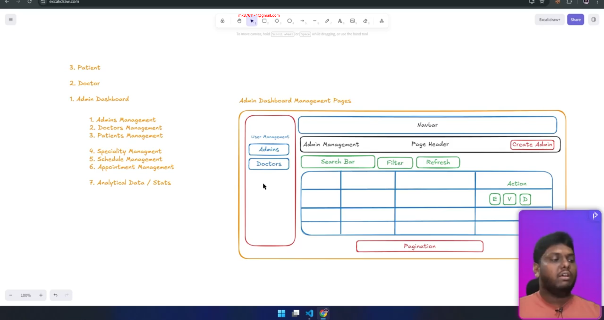

# PH-HEALTHCARE-FRONTEND-PART-5

GitHub Link: https://github.com/Apollo-Level2-Web-Dev/ph-health-care/tree/new-part-5

## 69-1 Creating serverFetch Function For Reusable Fetch Function
```ts
import { getCookie } from "@/services/auth/tokenHandler";

const BACKEND_API_URL = process.env.NEXT_PUBLIC_API_URL|| "http://localhost:5000/api/v1";

// auth/login
const serverFetchHelper = async (endpoint:string,options:RequestInit):Promise<Response>=>{
const {headers,...restOptions}=options;
const accessToken= await getCookie("accessToken");
const response = await fetch(`${BACKEND_API_URL}${endpoint}`,{
    headers:{
        ...headers,
        Cookie:accessToken ? `accessToken=${accessToken}`:"",
    },
    ...restOptions
})
return response
}

export const serverFetch = {
    get: async (endpoint: string, options: RequestInit = {}): Promise<Response> => serverFetchHelper(endpoint, { ...options, method: "GET" }),

    post: async (endpoint: string, options: RequestInit = {}): Promise<Response> => serverFetchHelper(endpoint, { ...options, method: "POST" }),

    put: async (endpoint: string, options: RequestInit = {}): Promise<Response> => serverFetchHelper(endpoint, { ...options, method: "PUT" }),

    patch: async (endpoint: string, options: RequestInit = {}): Promise<Response> => serverFetchHelper(endpoint, { ...options, method: "PATCH" }),

    delete: async (endpoint: string, options: RequestInit = {}): Promise<Response> => serverFetchHelper(endpoint, { ...options, method: "DELETE" }),

}

/**
 * 
 * serverFetch.get("/auth/me")
 * serverFetch.post("/auth/login", { body: JSON.stringify({}) })
 */
```

## 69-2 Analyzing The Admin Dashboard Management Pages


## 69-3 Creating Reusable Management Table Components
```ts
"use client";
import { Edit, Eye, Loader2, MoreHorizontal, Trash } from "lucide-react";
import React from "react";
import { Button } from "../ui/button";
import {
  DropdownMenu,
  DropdownMenuContent,
  DropdownMenuItem,
  DropdownMenuTrigger,
} from "../ui/dropdown-menu";
import {
  Table,
  TableBody,
  TableCell,
  TableHead,
  TableHeader,
  TableRow,
} from "../ui/table";

export interface Column<T> {
  header: string;
  accessor: keyof T | ((row: T) => React.ReactNode);
  className?: string;
}

interface ManagementTableProps<T> {
  data: T[];
  columns: Column<T>[];
  onView?: (row: T) => void;
  onEdit?: (row: T) => void;
  onDelete?: (row: T) => void;
  getRowKey: (row: T) => string;
  emptyMessage?: string;
  isRefreshing?: boolean;
}

// const ManagementTable<T> = (props: ManagementTableProps<T>) => {
//   return <div>ManagementTable</div>;
// };

function ManagementTable<T>({
  data = [],
  columns = [],
  onView,
  onEdit,
  onDelete,
  getRowKey,
  emptyMessage = "No records found.",
  isRefreshing = false,
}: ManagementTableProps<T>) {
  const hasActions = onView || onEdit || onDelete;
  return (
    <>
      <div className="rounded-lg border relative">
        {/* Refreshing Overlay */}
        {isRefreshing && (
          <div className="absolute inset-0 bg-background/50 backdrop-blur-[2px] flex items-center justify-center z-10 rounded-lg">
            <div className="flex flex-col items-center gap-2">
              <Loader2 className="h-6 w-6 animate-spin text-primary" />
              <p className="text-sm text-muted-foreground">Refreshing...</p>
            </div>
          </div>
        )}

        <Table>
          <TableHeader>
            <TableRow>
              {columns?.map((column, colIndex) => (
                <TableHead key={colIndex} className={column.className}>
                  {column.header}
                </TableHead>
              ))}

              {hasActions && (
                <TableHead className="w-[70px]">Actions</TableHead>
              )}
            </TableRow>
          </TableHeader>

          <TableBody>
            {data.length === 0 ? (
              <TableRow>
                <TableCell
                  colSpan={columns.length + (hasActions ? 1 : 0)}
                  className="text-center py-8 text-muted-foreground"
                >
                  {emptyMessage}
                </TableCell>
              </TableRow>
            ) : (
              data?.map((item) => (
                <TableRow key={getRowKey(item)}>
                  {columns.map((col, idx) => (
                    <TableCell key={idx} className={col.className}>
                      {typeof col.accessor === "function"
                        ? col.accessor(item)
                        : String(item[col.accessor])}
                    </TableCell>
                  ))}
                  {hasActions && (
                    <TableCell>
                      <DropdownMenu>
                        <DropdownMenuTrigger asChild>
                          <Button variant="ghost" size="icon">
                            <MoreHorizontal className="h-4 w-4" />
                          </Button>
                        </DropdownMenuTrigger>
                        <DropdownMenuContent align="end">
                          {onView && (
                            <DropdownMenuItem onClick={() => onView(item)}>
                              <Eye className="mr-2 h-4 w-4" />
                              View
                            </DropdownMenuItem>
                          )}
                          {onEdit && (
                            <DropdownMenuItem onClick={() => onEdit(item)}>
                              <Edit className="mr-2 h-4 w-4" />
                              Edit
                            </DropdownMenuItem>
                          )}
                          {onDelete && (
                            <DropdownMenuItem
                              onClick={() => onDelete(item)}
                              className="text-destructive"
                            >
                              <Trash className="mr-2 h-4 w-4" />
                              Delete
                            </DropdownMenuItem>
                          )}
                        </DropdownMenuContent>
                      </DropdownMenu>
                    </TableCell>
                  )}
                </TableRow>
              ))
            )}
          </TableBody>
        </Table>
      </div>
    </>
  );
}

export default ManagementTable;
```

## 69-4 Creating Reusable Management Page Header and Refresh Button Components
- shared managementPageHeader.tsx
```ts
"use client";
import { LucideIcon, Plus } from "lucide-react";
import React from "react";
import { Button } from "../ui/button";

interface ManagementPageHeaderProps {
  title: string;
  description?: string;
  action?: {
    icon?: LucideIcon;
    label: string;
    onClick: () => void;
  };
  children?: React.ReactNode;
}

const ManagementPageHeader = ({
  title,
  description,
  action,
  children,
}: ManagementPageHeaderProps) => {
  const Icon = action?.icon || Plus;
  return (
    <div className="flex items-center justify-between">
      <div>
        <h1 className="text-3xl font-bold">{title}</h1>
        {description && (
          <p className="text-muted-foreground mt-1">{description}</p>
        )}
      </div>
      {action && (
        <Button onClick={action.onClick}>
          <Icon className="mr-2 h-4 w-4" />
          {action.label}
        </Button>
      )}
      {children}
    </div>
  );
};

export default ManagementPageHeader;
```
- shared - refreshButton.tsx
```ts
"use client";
import { RefreshCcw } from "lucide-react";
import { useRouter } from "next/navigation";
import { useTransition } from "react";
import { Button } from "../ui/button";

interface RefreshButtonProps {
  size?: "sm" | "default" | "lg";
  variant?: "default" | "outline" | "ghost";
  showLabel?: boolean;
}

const RefreshButton = ({
  size = "default",
  variant = "default",
  showLabel = true,
}: RefreshButtonProps) => {
  const router = useRouter();
  const [isPending, startTransition] = useTransition();

  const handleRefresh = () => {
    startTransition(() => {
      router.refresh();
    });
  };
  return (
    <Button
      size={size}
      variant={variant}
      onClick={handleRefresh}
      disabled={isPending}
    >
      <RefreshCcw
        className={`h-4 w-4 ${isPending ? "animate-spin" : ""} ${
          showLabel ? "mr-2" : ""
        }`}
      />
      {showLabel && "Refresh"}
    </Button>
  );
};

export default RefreshButton;
```

## 69-5 Creating Reusable Search Filter and Select Filter Components

- lets think about the search and filter 
- the route will be `http://localhost:3000/admin/dashboard/admins-management`
- if search happens the route will be `http://localhost:3000/admin/dashboard/admins-management?searchTerm=abc`. basically it will be query parameter 
- For Filter `http://localhost:3000/admin/dashboard/admins-management?searchjjTerm="admin1&role="superAdmin"`.
- Setting query parameter is the efficient way to do this. The `searchTerm`, and the `filter` will be returned to the `server action` of the table immediately and automatic refetching will be done.
- in the same method the pagination will work. `http://localhost:3000/admin/dashboard/admins-management?searchjjTerm="admin1&role="superAdmin"&page=1`.
- beside these while we are doing search we will have to use `debounce`. The purpose of `debounce` is to limit the number of api calls while typing. so if we type `a`, `ab`, `abc` in quick succession we will not make 3 api calls rather we will make only one api call after some delay like 500ms after the last key stroke.This will prevent api misuse and unnecessary load on the server.
- src -> hooks -> useDebounce.ts

```ts
import { useEffect, useState } from "react";

export function useDebounce<T>(value: T, delay: number = 500): T {
    const [debouncedValue, setDebouncedValue] = useState<T>(value);

    useEffect(() => {
        const handler = setTimeout(() => {
            setDebouncedValue(value);
        }, delay);

        return () => {
            clearTimeout(handler);
        };
    }, [value, delay]);

    return debouncedValue;
}
```
- component -> shared -> SearchFilter.tsx

```tsx
"use client"

import { Search } from "lucide-react";
import { Input } from "../ui/input";
import { useEffect, useState, useTransition } from "react";
import { useRouter, useSearchParams } from "next/navigation";
import { useDebounce } from "@/hooks/useDebounce";

/**
 * Props for `SearchFilter` component.
 * - `placeholder`: input placeholder text.
 * - `paramName`: query parameter name used in the URL (e.g. `?searchTerm=...`).
 */
interface SearchFilterProps {
    placeholder?: string;
    paramName?: string // ?searchTerm="admin" here the paramName is searchTerm
}

/**
 * SearchFilter
 * - Controlled input that updates the current URL query string using Next.js router.
 * - Uses a debounce hook so the URL is only updated after the user stops typing.
 * - Resets the `page` parameter to `1` when a new search is applied.
 *
 * Note: the input is currently rendered with `disabled` — keep this if the search
 * should be read-only in the UI, otherwise remove the `disabled` prop.
 */
const SearchFilter = ({ placeholder = "Search....", paramName = "searchTerm" }: SearchFilterProps) => {
    const router = useRouter()
    // useTransition lets us mark the router update as non-urgent
    // We only need the `startTransition` function here; avoid an unused variable.
    const [, startTransition] = useTransition()
    const searchParams = useSearchParams()

    // Initialize the controlled input from the current query param (if present)
    const [value, setValue] = useState(searchParams.get(paramName) || "")

    // Debounce the `value` so we don't update the URL on every keystroke
    const debouncedValue = useDebounce(value, 500)

    useEffect(() => {
        // Copy current search params so we can modify them
        const params = new URLSearchParams(searchParams.toString());

        // When the component mounts, `useState` might already have the initial value
        // from the URL. If the debounced value equals the initial URL value, do nothing.
        const initialValue = searchParams.get(paramName) || ""
        if (initialValue === debouncedValue) return; // no need to push the same value again

        if (debouncedValue) {
            // Add/update the search param and reset pagination to page 1
            params.set(paramName, debouncedValue)  // ?searchTerm=debouncedValue
            params.set("page", "1") // reset to first page on search
        } else {
            // If the search term is cleared, remove the param(s) from the URL
            params.delete(paramName)
            params.delete("page") // also remove page param if no search term
        }

        // Use startTransition to avoid blocking urgent updates/UI
        startTransition(() => {
            // Push the updated query string to the router
            router.push(`?${params.toString()}`)
        })

    }, [debouncedValue, paramName, router, searchParams])

    return (
        <div className="relative">
            {/* Search icon positioned inside the input */}
            <Search className="absolute left-3 top-1/2 -translate-y-1/2 h-4 w-4 text-muted-foreground" />

            {/* Controlled input: value is kept in component state and debounced
                before writing into the URL. Remove `disabled` if users should be
                allowed to type (it's currently present to render a non-editable field).
            */}
            <Input
                placeholder={placeholder}
                value={value}
                onChange={(e) => setValue(e.target.value)}
                disabled
                className="pl-10"
            />
        </div>
    );
};

export default SearchFilter;
```