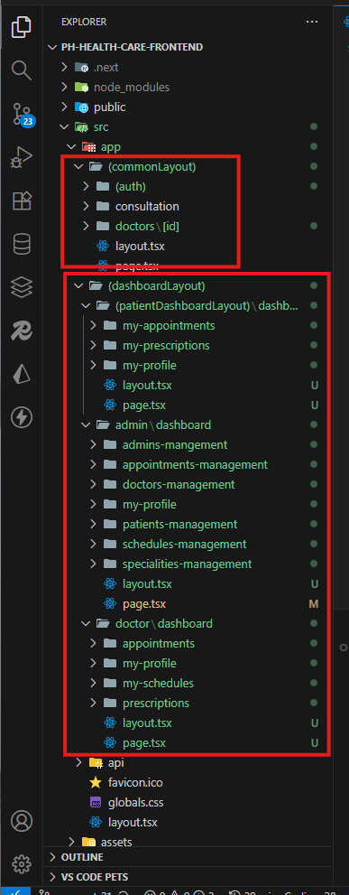

## PH-HEALTHCARE-FRONTEND-PART-2

GitHub Link: https://github.com/Apollo-Level2-Web-Dev/ph-health-care/tree/part-2


## 66-2 Routing Setup In The Project


## 66-1 Planning The Routing Architecture Of Ph Healthcare

- In this project we have 3 category users. 
  1. Admin
  2. Doctor
  3. Patient

- `Public Pages` - These pages can be accessed by any user without authentication.
  - Home Page (/)
  - About Page (/about)
  - Contact Page
- `Public Auth pages` - These pages can be accessed by any user for authentication purposes.
  - Login Page (/login)
  - Register Page(/register)
  -  Forget Password Page
  -  Reset Password Page

- `Protected Patient pages` - These pages can only be accessed by authenticated patients.
  - Patient Dashboard (/dashboard)
  - My Appointment Page (/dashboard/my-appointment)
  - My Profile Page (/dashboard/my-profile)

- `Protected Doctor pages` - These pages can only be accessed by authenticated doctors.
  - Doctor Dashboard (/doctor/dashboard)
  - Appointments Page (/doctor/dashboard/appointments)
  - My Profile Page (/doctor/dashboard/my-profile)
  - My Schedule Page (/doctor/dashboard/my-schedule)

- `Protected Admin pages` - These pages can only be accessed by authenticated admins.
  - Admin Dashboard (/admin/dashboard)
  - Manage Doctors (/admin/dashboard/manage-doctors)
  - Mange Patients (/admin/dashboard/manage-patients)
  - Statistics Managements (/admin/dashboard/statistics)
  - My profile (/admin/dashboard/my-profile)

## 66-2 Routing Setup In The Project

- see the folder structure and code files for routing setup.

## 66-3 Creating Login And Register Forms

- Next.js is fullstack framework . It has its own backend system. But we are using our own backend for the project. In react The backend api are consumed in component level. In next.js we can consume in component level but it is better to consume in `app/api` folder that means we will use next.js backend help to consume api. That means there will be communication between next.js backend and our backend system . From frontend a request will come in next.js backend then then next.js backend will communicate with our backend system. After getting response from our backend system next.js backend will send response to frontend. the purpose is to keep our api secret from frontend. its more secure. because the next.js backend api calls will not reach in browser end. 

- There are two types of component in next.js 
  1. Server Component (by default every component is server component)
  2. Client Component (if we want to use react hooks or any library that works in browser only like `react-toastify` etc we have to make that component as client component by adding `"use client"` in top of the file.) client component is fully a react component. ()

- majority time we will use server component but when we need to use react hooks or any library that works in browser only we will use client component.

- install fields 

```
npx shadcn@latest add field
```

- commonLayout  -> auth -> login -> page.tsx

```tsx 
import LoginForm from "@/components/login-form";


const LoginPage = () => {
  return (
    <div className="flex min-h-screen items-center justify-center">
      <div className="w-full max-w-md space-y-6 rounded-lg border p-8 shadow-lg">
        <div className="space-y-2 text-center">
          <h1 className="text-3xl font-bold">Welcome Back</h1>
          <p className="text-gray-500">
            Enter your credentials to access your account
          </p>
        </div>
        <LoginForm />
      </div>
    </div>
  );
};

export default LoginPage;
```
- components -> login-form.tsx

```tsx 

"use client";
import { Button } from "./ui/button";
import { Field, FieldDescription, FieldGroup, FieldLabel } from "./ui/field";
import { Input } from "./ui/input";
const LoginForm = () => {


  return (
    <form >
      <FieldGroup>
        <div className="grid grid-cols-1 gap-4">
          {/* Email */}
          <Field>
            <FieldLabel htmlFor="email">Email</FieldLabel>
            <Input
              id="email"
              name="email"
              type="email"
              placeholder="m@example.com"
              //   required
            />
          </Field>

          {/* Password */}
          <Field>
            <FieldLabel htmlFor="password">Password</FieldLabel>
            <Input
              id="password"
              name="password"
              type="password"
              placeholder="Enter your password"
              //   required
            />

          </Field>
        </div>
        <FieldGroup className="mt-4">
          <Field>
            <Button type="submit" >
              Login
            </Button>

            <FieldDescription className="px-6 text-center">
              Don&apos;t have an account?{" "}
              <a href="/register" className="text-blue-600 hover:underline">
                Sign up
              </a>
            </FieldDescription>
            <FieldDescription className="px-6 text-center">
              <a
                href="/forget-password"
                className="text-blue-600 hover:underline"
              >
                Forgot password?
              </a>
            </FieldDescription>
          </Field>
        </FieldGroup>
      </FieldGroup>
    </form>
  );
};

export default LoginForm;
```
- commonLayout  -> auth -> register -> page.tsx

```tsx 

import RegisterForm from "@/components/register-form";
import {
    Card,
    CardContent,
    CardDescription,
    CardHeader,
    CardTitle,
} from "@/components/ui/card";

const RegisterPage = () => {
    return (
        <>
            <div className="flex min-h-svh w-full items-center justify-center p-6 md:p-10">
                <div className="w-full max-w-xl">
                    <Card>
                        <CardHeader>
                            <CardTitle>Create an account</CardTitle>
                            <CardDescription>
                                Enter your information below to create your account
                            </CardDescription>
                        </CardHeader>
                        <CardContent>
                            <RegisterForm />
                        </CardContent>
                    </Card>
                </div>
            </div>
        </>
    );
};

export default RegisterPage;
```
- components -> register-form.tsx

```tsx 

"use client";
import { Button } from "./ui/button";
import { Field, FieldDescription, FieldGroup, FieldLabel } from "./ui/field";
import { Input } from "./ui/input";


const RegisterForm = () => {
    return (
        <form>
            <FieldGroup>
                <div className="grid grid-cols-1 md:grid-cols-2 gap-4">
                    {/* Name */}
                    <Field>
                        <FieldLabel htmlFor="name">Full Name</FieldLabel>
                        <Input id="name" name="name" type="text" placeholder="John Doe" />
    
                    </Field>
                    {/* Address */}
                    <Field>
                        <FieldLabel htmlFor="address">Address</FieldLabel>
                        <Input
                            id="address"
                            name="address"
                            type="text"
                            placeholder="123 Main St"
                        />

                    </Field>
                    {/* Email */}
                    <Field>
                        <FieldLabel htmlFor="email">Email</FieldLabel>
                        <Input
                            id="email"
                            name="email"
                            type="email"
                            placeholder="m@example.com"
                        />

                    </Field>
                    {/* Password */}
                    <Field>
                        <FieldLabel htmlFor="password">Password</FieldLabel>
                        <Input id="password" name="password" type="password" />

                    </Field>
                    {/* Confirm Password */}
                    <Field className="md:col-span-2">
                        <FieldLabel htmlFor="confirmPassword">Confirm Password</FieldLabel>
                        <Input
                            id="confirmPassword"
                            name="confirmPassword"
                            type="password"
                        />

                    </Field>
                </div>
                <FieldGroup className="mt-4">
                    <Field>
                        <Button type="submit">
                            Create Account
                        </Button>

                        <FieldDescription className="px-6 text-center">
                            Already have an account?{" "}
                            <a href="/login" className="text-blue-600 hover:underline">
                                Sign in
                            </a>
                        </FieldDescription>
                    </Field>
                </FieldGroup>
            </FieldGroup>
        </form>
    );
};

export default RegisterForm;
```

## 66-4 Form Handling With Useactionstate Hook

- Implement form handling using useActionState hook in login-form.tsx and register-form.tsx components. this hook will help manage form state, handle submissions, and provide feedback to users during the authentication process. this is a unique procedure 

[useActionState](https://react.dev/reference/react/useActionState)


```jsx
const [state, formAction, isPending] = useActionState(fn, initialState, permalink?);
```

- we will use `useActionState` hook with the `form-action` pattern in next.js. this is a unique procedure of next.js
-  for handling form action the hook works a lot. 
-  `useActionState` gives three things 
  1. isPending - boolean value - shows the action is in pending state
  2. formAction - function - this function will wrap the form action function (when the form is submitted this function will be called)
  3. state - object - contains the state of the action (like errors etc)

- `useActionState` takes 3 things as a parameter
  1. fn - the function involved with api hit like fetch function.
  2. initialState
  3. permalink?


| Element        | Type              | Purpose                                      |
| -------------- | ----------------- | -------------------------------------------- |
| `fn`           | Function          | The action logic (API or DB call)            |
| `initialState` | Any               | Starting value of `state`                    |
| `permalink?`   | string (optional) | Persistent key for state between navigations |
| `state`        | object            | Current state (result of `fn`)               |
| `formAction`   | function          | Passed to `<form action={formAction}>`       |
| `isPending`    | boolean           | True when action is running                  |


- components -> register-form.tsx (miniature usage of useActionState hook)

```tsx
/* eslint-disable @typescript-eslint/no-explicit-any */

"use client";
import { useActionState } from "react";
import { Button } from "./ui/button";
import { Field, FieldDescription, FieldGroup, FieldLabel } from "./ui/field";
import { Input } from "./ui/input";


const RegisterForm = () => {
    const [state, formAction, isPending] = useActionState((currentState : any, formData : any) => {
        console.log("currentState",currentState)
        console.log("formData", formData.get("name"))

        return { success: true  };
     }, null)

    console.log("state :", state)

    return (
        <form action={formAction}>
            <FieldGroup>
                <div className="grid grid-cols-1 md:grid-cols-2 gap-4">
                    {/* Name */}
                    <Field>
                        <FieldLabel htmlFor="name">Full Name</FieldLabel>
                        <Input id="name" name="name" type="text" placeholder="John Doe" />

                    </Field>
                    {/* Address */}
                    <Field>
                        <FieldLabel htmlFor="address">Address</FieldLabel>
                        <Input
                            id="address"
                            name="address"
                            type="text"
                            placeholder="123 Main St"
                        />

                    </Field>
                    {/* Email */}
                    <Field>
                        <FieldLabel htmlFor="email">Email</FieldLabel>
                        <Input
                            id="email"
                            name="email"
                            type="email"
                            placeholder="m@example.com"
                        />

                    </Field>
                    {/* Password */}
                    <Field>
                        <FieldLabel htmlFor="password">Password</FieldLabel>
                        <Input id="password" name="password" type="password" />

                    </Field>
                    {/* Confirm Password */}
                    <Field className="md:col-span-2">
                        <FieldLabel htmlFor="confirmPassword">Confirm Password</FieldLabel>
                        <Input
                            id="confirmPassword"
                            name="confirmPassword"
                            type="password"
                        />

                    </Field>
                </div>
                <FieldGroup className="mt-4">
                    <Field>
                        <Button type="submit" disabled={isPending}>
                            {isPending ? "Creating Account..." : "Create Account"}
                        </Button>
                        <FieldDescription className="px-6 text-center">
                            Already have an account?{" "}
                            <a href="/login" className="text-blue-600 hover:underline">
                                Sign in
                            </a>
                        </FieldDescription>
                    </Field>
                </FieldGroup>
            </FieldGroup>
        </form>
    );
};

export default RegisterForm;
```
## 66-5 Submitting Form With Server Action

- src -> services -> auth -> registerPatient.ts

```tsx
/* eslint-disable @typescript-eslint/no-explicit-any */
"use server"

export const registerPatient = async (_currentState: any, formData: any): Promise<any> => {
    // register patient logic here
    try {
        const registerData = {
            password: formData.get("password"),
            patient: {
                name: formData.get("name"),
                address: formData.get("address"),
                email: formData.get("email"),
            }
        }

        const newFormData = new FormData()
        // new form data is created because original form data is formatted into an object then again needs to converted to form data as our backend only accepts form data

        newFormData.append("data", JSON.stringify(registerData))

        const res = await fetch("http://localhost:5000/api/v1/user/create-patient", {
            method: "POST",
            body: newFormData
        }).then(res => res.json())

        console.log(res)
        return res

    } catch (error) {
        console.error("Error registering patient:", error)
        return {
            error: "Error registering patient"
        }
    }
};

```

- components -> register-form.tsx (importing and using the server action in useActionState hook)

```tsx


"use client";
import { useActionState } from "react";
import { Button } from "./ui/button";
import { Field, FieldDescription, FieldGroup, FieldLabel } from "./ui/field";
import { Input } from "./ui/input";
import { registerPatient } from "@/services/auth/registerPatient";


const RegisterForm = () => {
    const [state, formAction, isPending] = useActionState(registerPatient, null)

    console.log("state :", state)

    return (
        <form action={formAction}>
            <FieldGroup>
                <div className="grid grid-cols-1 md:grid-cols-2 gap-4">
                    {/* Name */}
                    <Field>
                        <FieldLabel htmlFor="name">Full Name</FieldLabel>
                        <Input id="name" name="name" type="text" placeholder="John Doe" />

                    </Field>
                    {/* Address */}
                    <Field>
                        <FieldLabel htmlFor="address">Address</FieldLabel>
                        <Input
                            id="address"
                            name="address"
                            type="text"
                            placeholder="123 Main St"
                        />

                    </Field>
                    {/* Email */}
                    <Field>
                        <FieldLabel htmlFor="email">Email</FieldLabel>
                        <Input
                            id="email"
                            name="email"
                            type="email"
                            placeholder="m@example.com"
                        />

                    </Field>
                    {/* Password */}
                    <Field>
                        <FieldLabel htmlFor="password">Password</FieldLabel>
                        <Input id="password" name="password" type="password" />

                    </Field>
                    {/* Confirm Password */}
                    <Field className="md:col-span-2">
                        <FieldLabel htmlFor="confirmPassword">Confirm Password</FieldLabel>
                        <Input
                            id="confirmPassword"
                            name="confirmPassword"
                            type="password"
                        />

                    </Field>
                </div>
                <FieldGroup className="mt-4">
                    <Field>
                        <Button type="submit" disabled={isPending}>
                            {isPending ? "Creating Account..." : "Create Account"}
                        </Button>
                        <FieldDescription className="px-6 text-center">
                            Already have an account?{" "}
                            <a href="/login" className="text-blue-600 hover:underline">
                                Sign in
                            </a>
                        </FieldDescription>
                    </Field>
                </FieldGroup>
            </FieldGroup>
        </form>
    );
};

export default RegisterForm;
```

- services -> auth -> loginUser.ts 

```ts

/* eslint-disable @typescript-eslint/no-explicit-any */

"use server"

export const loginUser = async (_currentState: any, formData: any): Promise<any> => {
    try {
        const loginData = {
            email: formData.get("email"),
            password: formData.get("password"),
        }
        const response = await fetch("http://localhost:5000/api/v1/auth/login", {
            method: "POST",
            headers: {
                "Content-Type": "application/json",
            },
            body: JSON.stringify(loginData),
        }).then(res => res.json())
        return response
    } catch (error) {
        console.log(error)
        return { error: "Error logging in user" }
    }
}

```

- components -> login-form.tsx (importing and using the server action in useActionState hook)

```tsx 

"use client";
import { loginUser } from "@/services/auth/loginUser";
import { Button } from "./ui/button";
import { Field, FieldDescription, FieldGroup, FieldLabel } from "./ui/field";
import { Input } from "./ui/input";
import { useActionState } from "react";
const LoginForm = () => {
const [state, formAction, isPending] = useActionState(loginUser, null);

console.log("state", state)

  return (
    <form action={formAction} >
      <FieldGroup>
        <div className="grid grid-cols-1 gap-4">
          {/* Email */}
          <Field>
            <FieldLabel htmlFor="email">Email</FieldLabel>
            <Input
              id="email"
              name="email"
              type="email"
              placeholder="m@example.com"
              //   required
            />
          </Field>

          {/* Password */}
          <Field>
            <FieldLabel htmlFor="password">Password</FieldLabel>
            <Input
              id="password"
              name="password"
              type="password"
              placeholder="Enter your password"
              //   required
            />

          </Field>
        </div>
        <FieldGroup className="mt-4">
          <Field>
            <Button type="submit" disabled={isPending}>
              {isPending ? "Logging in..." : "Login"}
            </Button>

            <FieldDescription className="px-6 text-center">
              Don&apos;t have an account?{" "}
              <a href="/register" className="text-blue-600 hover:underline">
                Sign up
              </a>
            </FieldDescription>
            <FieldDescription className="px-6 text-center">
              <a
                href="/forget-password"
                className="text-blue-600 hover:underline"
              >
                Forgot password?
              </a>
            </FieldDescription>
          </Field>
        </FieldGroup>
      </FieldGroup>
    </form>
  );
};

export default LoginForm;
```

- as the login is done in client side we are not able to grab the cookie in our browser which was supposed to be set in the headers in backend response. The reason is the browser can not access next.js server works as it secure. 
- We have to deal with it further. 

## 66-7 Login Form Error Handling And Data Validations

- form validation works will be done in server action functions

- install zod 

```
npm install zod
```


| Method        | Behavior                                                      | Example Output                             |
| ------------- | ------------------------------------------------------------- | ------------------------------------------ |
| `parse()`     | Throws an exception if data is invalid                        | ❌ crashes your code unless you `try/catch` |
| `safeParse()` | Returns a result object `{ success: true/false, data/error }` | ✅ never throws, easy to handle             |

- src - services -> loginUser.ts 


```ts 
/* eslint-disable @typescript-eslint/no-explicit-any */
"use server"

import z from "zod";

const loginValidationZodSchema = z.object({
    email: z.email({
        message: "Email is required",
    }),
    password: z.string("Password is required").min(6, {
        error: "Password is required and must be at least 6 characters long",
    }).max(100, {
        error: "Password must be at most 100 characters long",
    }),
});

export const loginUser = async (_currentState: any, formData: any): Promise<any> => {
    try {
        const loginData = {
            email: formData.get('email'),
            password: formData.get('password'),
        }

        const validatedFields = loginValidationZodSchema.safeParse(loginData);

        if (!validatedFields.success) {
            return {
                success: false,
                errors: validatedFields.error.issues.map(issue => {
                    return {
                        field: issue.path[0],
                        message: issue.message,
                    }
                })
            }
        }

        const res = await fetch("http://localhost:5000/api/v1/auth/login", {
            method: "POST",
            body: JSON.stringify(loginData),
            headers: {
                "Content-Type": "application/json",
            },
        }).then(res => res.json());


        return res;

    } catch (error) {
        console.log(error);
        return { error: "Login failed" };
    }
}
```

- src -> components -> login-form.tsx 

```tsx 
/* eslint-disable @typescript-eslint/no-explicit-any */
"use client";
import { loginUser } from "@/services/auth/loginUser";
import { useActionState } from "react";
import { Button } from "./ui/button";
import { Field, FieldDescription, FieldGroup, FieldLabel } from "./ui/field";
import { Input } from "./ui/input";

const LoginForm = () => {
  const [state, formAction, isPending] = useActionState(loginUser, null);

  const getFieldError = (fieldName: string) => {
    if (state && state.errors) {
      const error = state.errors.find((err: any) => err.field === fieldName);
      return error.message;
    } else {
      return null;
    }
  };
  console.log(state);
  return (
    <form action={formAction}>
      <FieldGroup>
        <div className="grid grid-cols-1 gap-4">
          {/* Email */}
          <Field>
            <FieldLabel htmlFor="email">Email</FieldLabel>
            <Input
              id="email"
              name="email"
              type="email"
              placeholder="m@example.com"
              //   required
            />

            {getFieldError("email") && (
              <FieldDescription className="text-red-600">
                {getFieldError("email")}
              </FieldDescription>
            )}
          </Field>

          {/* Password */}
          <Field>
            <FieldLabel htmlFor="password">Password</FieldLabel>
            <Input
              id="password"
              name="password"
              type="password"
              placeholder="Enter your password"
              //   required
            />
            {getFieldError("password") && (
              <FieldDescription className="text-red-600">
                {getFieldError("password")}
              </FieldDescription>
            )}
          </Field>
        </div>
        <FieldGroup className="mt-4">
          <Field>
            <Button type="submit" disabled={isPending}>
              {isPending ? "Logging in..." : "Login"}
            </Button>

            <FieldDescription className="px-6 text-center">
              Don&apos;t have an account?{" "}
              <a href="/register" className="text-blue-600 hover:underline">
                Sign up
              </a>
            </FieldDescription>
            <FieldDescription className="px-6 text-center">
              <a
                href="/forget-password"
                className="text-blue-600 hover:underline"
              >
                Forgot password?
              </a>
            </FieldDescription>
          </Field>
        </FieldGroup>
      </FieldGroup>
    </form>
  );
};

export default LoginForm;
```

## 66-8 Register Form Error Handling And Data Validations, 66-9 Fixing The Issues In Register Patient Zod Schema

- 

- src -> services -> auth -> registerPatient.ts 

```tsx
/* eslint-disable @typescript-eslint/no-explicit-any */
"use server"

import z from "zod";

const registerValidationZodSchema = z.object({
    name: z.string().min(1, { message: "Name is required" }),
    address: z.string().optional(),
    email: z.email({ message: "Valid email is required" }),
    password: z.string().min(6, {
        error: "Password is required and must be at least 6 characters long",
    }).max(100, {
        error: "Password must be at most 100 characters long",
    }),
    confirmPassword: z.string().min(6, {
        error: "Confirm Password is required and must be at least 6 characters long",
    }),
}).refine((data: any) => data.password === data.confirmPassword, {
    error: "Passwords do not match",
    path: ["confirmPassword"],
});


export const registerPatient = async (_currentState: any, formData: any): Promise<any> => {
    try {
        console.log(formData.get("address"));
        const validationData = {
            name: formData.get('name'),
            address: formData.get('address'),
            email: formData.get('email'),
            password: formData.get('password'),
            confirmPassword: formData.get('confirmPassword'),
        }

        const validatedFields = registerValidationZodSchema.safeParse(validationData);

        console.log(validatedFields, "val");

        if (!validatedFields.success) {
            return {
                success: false,
                errors: validatedFields.error.issues.map(issue => {
                    return {
                        field: issue.path[0],
                        message: issue.message,
                    }
                }
                )
            }
        }

        const registerData = {
            password: formData.get('password'),
            patient: {
                name: formData.get('name'),
                address: formData.get('address'),
                email: formData.get('email'),
            }
        }

        const newFormData = new FormData();

        newFormData.append("data", JSON.stringify(registerData));

        const res = await fetch("http://localhost:5000/api/v1/user/create-patient", {
            method: "POST",
            body: newFormData,
        }).then(res => res.json());

        console.log(res, "res");

        return res;


    } catch (error) {
        console.log(error);
        return { error: "Registration failed" };
    }
}
```

- components -> register-form.tsx

```tsx 
/* eslint-disable @typescript-eslint/no-explicit-any */
"use client";

import { registerPatient } from "@/services/auth/registerPatient";
import { useActionState } from "react";
import { Button } from "./ui/button";
import { Field, FieldDescription, FieldGroup, FieldLabel } from "./ui/field";
import { Input } from "./ui/input";

const RegisterForm = () => {
  const [state, formAction, isPending] = useActionState(registerPatient, null);
  console.log(state, "state");

  const getFieldError = (fieldName: string) => {
    if (state && state.errors) {
      const error = state.errors.find((err: any) => err.field === fieldName);
      if (error) {
        return error.message;
      } else {
        return null;
      }
    } else {
      return null;
    }
  };
  return (
    <form action={formAction}>
      <FieldGroup>
        <div className="grid grid-cols-1 md:grid-cols-2 gap-4">
          {/* Name */}
          <Field>
            <FieldLabel htmlFor="name">Full Name</FieldLabel>
            <Input id="name" name="name" type="text" placeholder="John Doe" />
            {getFieldError("name") && (
              <FieldDescription className="text-red-600">
                {getFieldError("name")}
              </FieldDescription>
            )}
          </Field>
          {/* Address */}
          <Field>
            <FieldLabel htmlFor="address">Address</FieldLabel>
            <Input
              id="address"
              name="address"
              type="text"
              placeholder="123 Main St"
            />

            {getFieldError("address") && (
              <FieldDescription className="text-red-600">
                {getFieldError("address")}
              </FieldDescription>
            )}
          </Field>
          {/* Email */}
          <Field>
            <FieldLabel htmlFor="email">Email</FieldLabel>
            <Input
              id="email"
              name="email"
              type="email"
              placeholder="m@example.com"
            />

            {getFieldError("email") && (
              <FieldDescription className="text-red-600">
                {getFieldError("email")}
              </FieldDescription>
            )}
          </Field>
          {/* Password */}
          <Field>
            <FieldLabel htmlFor="password">Password</FieldLabel>
            <Input id="password" name="password" type="password" />

            {getFieldError("password") && (
              <FieldDescription className="text-red-600">
                {getFieldError("password")}
              </FieldDescription>
            )}
          </Field>
          {/* Confirm Password */}
          <Field className="md:col-span-2">
            <FieldLabel htmlFor="confirmPassword">Confirm Password</FieldLabel>
            <Input
              id="confirmPassword"
              name="confirmPassword"
              type="password"
            />

            {getFieldError("confirmPassword") && (
              <FieldDescription className="text-red-600">
                {getFieldError("confirmPassword")}
              </FieldDescription>
            )}
          </Field>
        </div>
        <FieldGroup className="mt-4">
          <Field>
            <Button type="submit" disabled={isPending}>
              {isPending ? "Creating Account..." : "Create Account"}
            </Button>

            <FieldDescription className="px-6 text-center">
              Already have an account?{" "}
              <a href="/login" className="text-blue-600 hover:underline">
                Sign in
              </a>
            </FieldDescription>
          </Field>
        </FieldGroup>
      </FieldGroup>
    </form>
  );
};

export default RegisterForm;
```